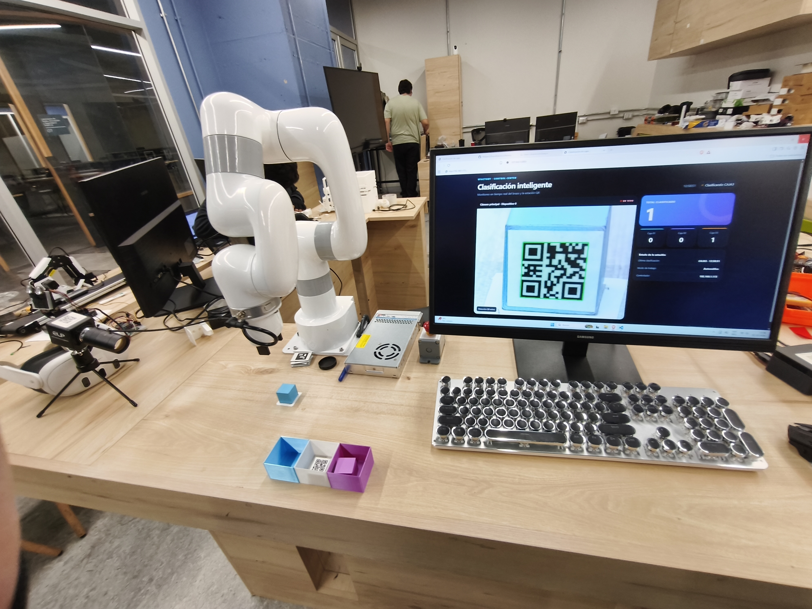
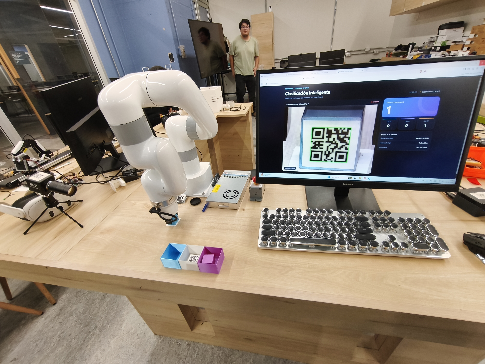
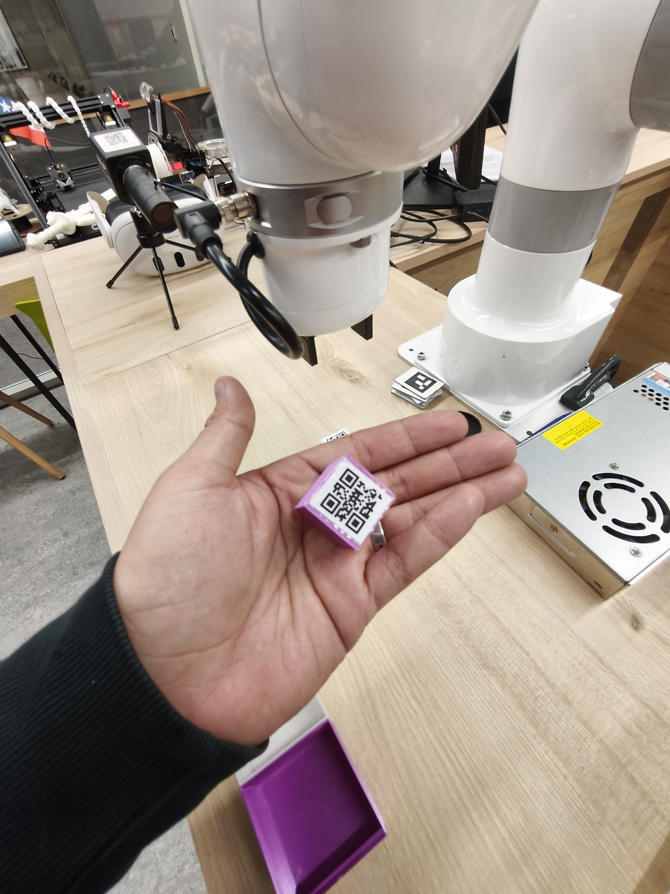

# Brazo robótico UFactory

Sistema de clasificación automatizada basado en un brazo robótico UFactory/Lite6, cámara USB y lectura de códigos QR. El proyecto integra visión artificial, control del robot y una interfaz web en tiempo real para monitorear el estado de la estación y contar las piezas clasificadas.

## Descripción general

Este proyecto está pensado para automatizar una tarea de clasificación de cajas o productos mediante un brazo robótico. La cámara detecta códigos QR, el software identifica cada artículo y el robot ejecuta un movimiento de recogida, transporte y depósito según la clasificación correspondiente.

La aplicación se compone de tres elementos principales:

- Un flujo de captura y análisis de video con OpenCV.
- Un control del brazo robótico mediante el SDK local `xarm`.
- Una interfaz web ligera en Flask para visualizar la cámara, el estado del robot y los contadores.

## Propósito educativo

Preparé esta demostración para mostrar a los estudiantes cómo funciona un brazo robótico y cómo la visión artificial permite automatizar tareas de clasificación sin que una persona deba identificar visualmente cada objeto durante la operación. La lectura de etiquetas QR conecta la identificación de una categoría con una secuencia de recogida, transporte y depósito en posiciones predefinidas.

## Objetivo

Automatizar la recepción, identificación y clasificación de elementos usando:

- un brazo robótico UFactory,
- una cámara USB para visión artificial,
- lectura de etiquetas QR,
- un panel web para supervisión en tiempo real.

## Características

- Detección de códigos QR en streaming de video.
- Clasificación automática por tipo de caja o referencia identificada.
- Control del brazo robotico con movimientos predefinidos.
- Interfaz web con estado del sistema y contadores por categoría.
- Supervisión del proceso en tiempo real desde el navegador.
- Integración directa con el SDK local del brazo sin depender de servicios externos.

## Arquitectura del sistema

```text
Cámara USB
    ↓
OpenCV / QR detection
    ↓
Lógica de clasificación
    ↓
Control del brazo UFactory (xarm SDK)
    ↓
Interfaz web Flask (estado, streaming, contadores)
```

## Estructura del proyecto

```text
BrazoRoboticoUfactory/
├── brazoCamara2.0.py       # Aplicación principal: cámara, QR, robot e interfaz web
├── requirements.txt         # Dependencias de Python
├── README.md                # Documentación del proyecto
├── xarm/                    # SDK local del brazo UFactory
│   ├── __init__.py
│   ├── version.py
│   ├── core/
│   ├── wrapper/
│   └── ...
└── ...
```

## Requisitos

Antes de ejecutar el proyecto, asegúrate de tener:

- Python 3.x
- Cámara USB conectada y disponible
- Brazo robótico UFactory/Lite6 en la misma red o con conexión disponible
- IP del robot configurada correctamente en la aplicación
- Dependencias del archivo `requirements.txt`

## Instalación

Desde la carpeta del proyecto, crea un entorno virtual e instala las dependencias:

```powershell
python -m venv .venv
.\.venv\Scripts\Activate.ps1
pip install -r requirements.txt
```

## Configuración

Antes de ejecutar la aplicación, revisa los valores principales en `brazoCamara2.0.py`, especialmente:

- la IP del brazo (`192.168.1.172` por defecto),
- el índice de la cámara (`0` en muchos equipos),
- la lógica de clasificación y movimientos del robot.

## Ejecución

Ejecuta la aplicación principal:

```powershell
python .\brazoCamara2.0.py
```

La aplicación levanta una interfaz web local accesible en:

```text
http://127.0.0.1:5000
```

En la vista principal se observa:

- el flujo de video en vivo de la cámara,
- el estado del robot,
- el total de elementos clasificados,
- los contadores por cada caja o categoría,
- la última clasificación realizada.

## Flujo de funcionamiento

1. La cámara captura el entorno.
2. El sistema detecta un código QR en la imagen.
3. El valor leído se normaliza y se identifica la clase o caja asociada.
4. El brazo se mueve para recoger la pieza.
5. El robot ubica la pieza en la posición de destino correspondiente.
6. El sistema registra la clasificación en la interfaz web.
7. El proceso vuelve a quedar listo para una nueva detección.

## Fotografías de la demostración

### Detección y supervisión



Vista de la estación: el panel muestra el código QR detectado, el estado del proceso y los contadores por categoría.

### Recogida de la pieza



El brazo se acerca a la pieza en la posición de recogida; los recipientes de destino y la supervisión web se ven en la misma escena.

### Identificación por QR



Detalle de una pieza etiquetada: el contenido del código QR identifica la categoría que determina su destino.

## Comportamiento del robot

La lógica del programa incluye una secuencia de movimiento del brazo que contempla:

- posicionamiento inicial,
- apertura del gripper,
- acercamiento para tomar la pieza,
- cierre del efector,
- elevación y transporte,
- desplazamiento hacia la zona de destino,
- liberación del objeto según la clasificación.

Tras cada ciclo, el sistema queda preparado para continuar con la siguiente operación.

## Archivos principales

- `brazoCamara2.0.py`: lógica central de cámara, QR, UI y movimientos del robot.
- `xarm/`: biblioteca del SDK del brazo UFactory.
- `requirements.txt`: dependencias del proyecto.
- `README.md`: documentación general del sistema.

## Solución de problemas

### Error de conexión con el brazo
- Verifica la IP del robot en la configuración.
- Confirma que el controlador del brazo esté disponible en la red.
- Revisa que el SDK `xarm` esté correctamente referenciado en la carpeta del proyecto.

### La cámara no se abre
- Comprobar que la cámara esté conectada y disponible.
- Cambiar el índice de la cámara si el dispositivo usado no es el `0`.
- Verificar que no exista otra aplicación usando la misma cámara.

### No se detectan QR
- Mejora la iluminación del entorno.
- Asegura que los códigos QR sean legibles y de alta contraste.
- Revisa el ángulo de la cámara y la distancia al objeto.

## Detener la aplicación

Para cerrar el programa, vuelve a la terminal donde se ejecuta y presiona:

```powershell
Ctrl+C
```

## Notas

Este proyecto está orientado a automatización industrial básica con visión artificial aplicada a un proceso de clasificación. Puede servir como base para ampliar la lógica con más tipos de piezas, más destinos de clasificación, integraciones con bases de datos o una interfaz más avanzada para monitoreo y control.
